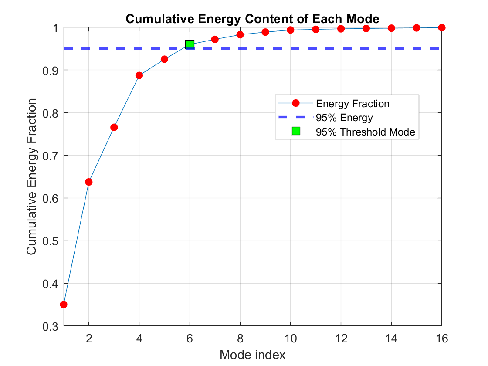
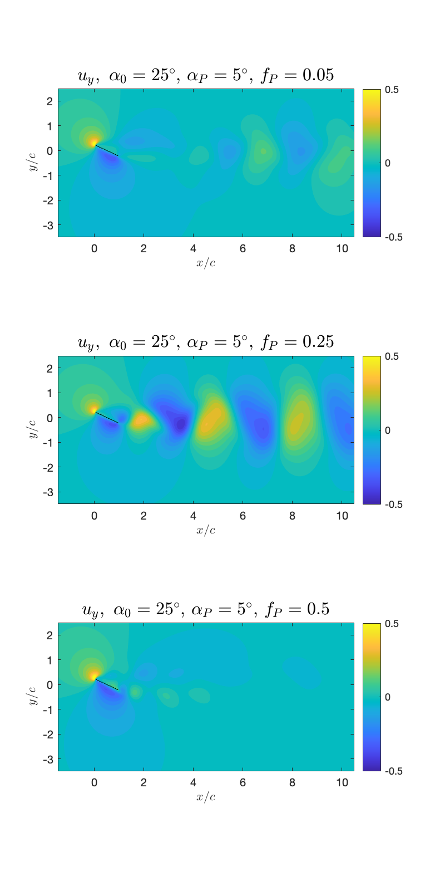
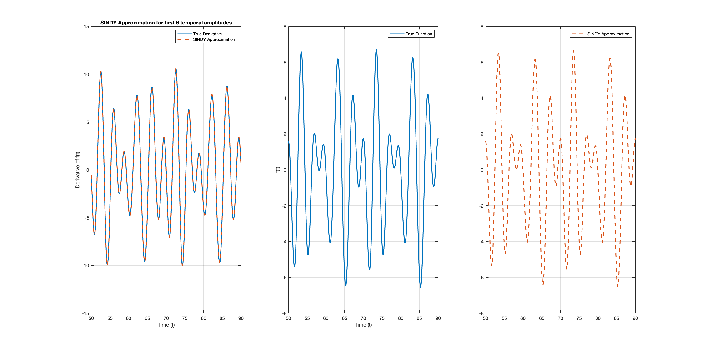

# ME494-Data Driven Methods
 2024 Spring Independent Study on Data Driven Methods in Mechanical Engineering

## POD Analysis 
To practice POD analysis, we have taken a data set from  http://deepblue.lib.umich.edu/data/collections/kk91fk98z. The data set that I chose for this assignment is low Reynolds number airfoil DNS with angle of attack of 25 degrees and pitching frequency of 0.05 degrees. 

### Plot of eigenvalues vs mode index

A closer look at the eigenvalue plot shows that the singular values of the data matrix are coming in a pair. This is an indication of an oscillatory pattern inside the fluid flow.

The above plot shows that the first 6 "modes" are enough to reconstruct 95% of the entire fluid flow.

### Plot of the first 6 temporal amplitudes. What is the frequency associated with oscillations?

The first two mode temporal amplitudes show about 45 degrees offset meaning the main dynamics of this fluid flow can be expressed by a combination of sine and cosine. Although the 2nd mode has nonlinear harmonic pattern, the two modes can be approximated to be almost perfect sinusoidal. The subsequent modes resemble the "beats" shape. I am not yet sure the physical intution behind such pattern but these subsequent modes also have the tendency of being a pair with approximately 45 degrees offset.

### Plot of the first 6 spatial modes

Now, the temporal amplitudes give us the frequency $f$. Then, once we have details of the flow condition, the fluid speed $c$ can also be computed. Then, $\lambda = c / f$ will give the wavelength associated with each oscillatory mode.

### Strouhal Number
The Strouhal number is a dimensionless number describing oscillating flow mechanisms. Typical fluid flow past cylinder should yied St $= 0.2$. Once the frequency $f$ associated with the dominant oscillatory mode pair is computed, the Strouhal number can be computed via $\frac{fL}{U}$ where L is the airfoil thickness, and U is the average flow velocity. 

### Fluid flow Reconstruction
Due to the file size limit, the reconstructed video can be found here: https://www.youtube.com/watch?v=-7NFyvJYAgo
The video shows that rank 6 approximation of the fluid flow reconstructs almost all the physics - vortices shedding with proper magnitude, osccilatory motion, and etc.

## DMD Analysis

This section talks about DMD analysis of the same data set.

### Temporal Amplitudes and the frequency associated with oscillations

The plot gives the temporal amplitude of each DMD mode.
From this plot, it can be seen that unlike POD where the dominant modes arise in descending order, the DMD modes do not necessarily align themselves conveninently.

The spatial mode plot above shows the frequencies associated with the dominant modes oscillations.
Furthermore, in attempt to get some more insight into the time-dynamics of the DMD modes, I attempted to plot the time-dynamics 
$\exp(\omega t)*\text{amplitude}$
however, I am running into results that are not physically sensible.

### Spatial modes and wavelength
As before, since frequency is given, wavelength associated with such mode can be easily computed. One takeaway here is as follows: Since POD does not take into account of time-dynamics, it's difficult to gauge the temporal frequency associated with each mode. In our example, the fluid flow has dominant oscillatory features which means the frequencies can be calculated visually. On the other hand, DMD gives a direct method of retrieving the temporal frequency. 

### Comparison of DMD and POD
The spatial modes of $u_x$ in both DMD and POD do show some similarities. However, they are not exact. This doesn't sound very intuitive to me at first because DMD is, after all, an extension of POD analysis. Hence, DMD should uncover physics beyond what POD analysis describes. (Question...)

## Sparse Identification of Nonlinear System (SINDY)
SINDY is essentially a data fitting technique. Suppose you are given a data set of $x = [x_1, x_2, x_3, ... , x_n].$ As long as the data is collected at a short-enough time interval, one can obtain an expression for $\dot{x} = [\dot{x_1}, ..., \dot{x_n}]$. Then, SINDY will throw a library of functions $\Theta$ and try to find the best fit regression for the given $\dot{x}$.

Above is my attempt at utilizing SINDY to reconstruct the first 6 temporal amplitudes that were retrieved via POD analysis. As one can see, the SINDY-found derivatives and reconstructed dynamics (used 'cumtrapz') are generally in alignement but there are some discrepancies especially at local extrema. Interestingly, although the derivatives show discrepancies, the reconstructed dynamics (f(x)) is exactly the same. I am hoping to get more insights into why this is occurring by taking a closer look at the actual expansion, what basis functions are being used, and etc.